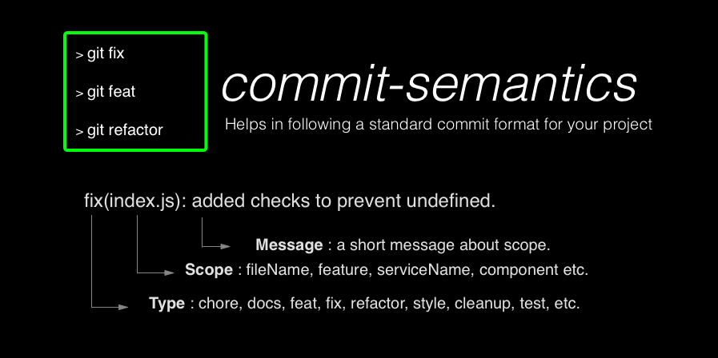

<p align="center">
  <a href="https://github.com/akanshgulati/commit-semantics" align="center">
    
  </a>
</p>

# Commit-Semantics

Inspired by Angular JS's committing style as on [github](https://github.com/angular/angular/commits/master), this project installs git aliases of various commit message type and helps in creating a standard of committing format.  

## Introduction
These are **custom git commands** that encourages the git user to write formatted git commit messages. These aliases will standardised git commits.

 e.g. ```git feat install.sh 'Added commit semantics aliases'``` -> ```git commit -m 'feat(install.sh): Added commit semantics aliases'```
 
 More shorter way possible now: 
 
 e.g. ```gf install.sh 'Added commit semantics aliases'``` -> ```git commit -m 'feat(install.sh): Added commit semantics aliases'```
## Installation

1. Clone this repo, preferably in your $HOME directory. ```git clone git@github.com:akanshgulati/commit-semantics.git
 ~/.commit-semantics```


2. Install it as git aliases:
   ```cd ~/.commit-semantics && chmod 755 install.sh && ./install.sh```

  Tip: You can check if aliases are created in `~/.gitconfig` file respectively. Aliases will be created only if no respective alias is present in `~/.gitconfig` file

3. Ready to use.

## Usage

Once you install, you can use 10 git aliases in following ways:
#### 1. __Only Committing__
**```git <type> <scope> <commit-message>```** -> **```git commit -m '<type>(<scope>): <commit-message>'```** 

e.g.
* _**git feat** install.sh "options in alias command"_ __->__ _git commit -m 'feat(install.sh): options in alias command'_
* _**git docs** LICENSE "update to apache 2.0 style"_ __->__ _git commit -m 'docs(LICENSE): update to apache 2.0 style'_
* _**git chore** package.json "task to uglify JS"_ __->__ _git commit -m 'chore(package.json): task to uglify JS'_
* _**git fix** app "maximum call stack issue"_ __->__ _git commit -m 'fix(app): maximum call stack issue'_
* _**git refactor** MainController "change callbacks to promises"_ __->__ _git commit -m 'refactor(MainController): change callbacks to promises'_
* _**git style** navbar "add sticky position"_ __->__ _git commit -m 'style(navbar): add sticky position'_
* _**git test** appSpec "fix test cases for init method"_ __->__ _git commit -m 'test(appSpec): fix test cases for init method'_
* _**git perf** accordion "add lazy load in thumbnails"_ __->__ _git commit -m 'perf(accordion): add lazy load in thumbnails'_
* _**git cleanup** dateFilter "remove unused dateChange method"_ __->__ _git commit -m 'cleanup(dateFilter): remove unused dateChange method'_
* _**git tracking** sidebar "add click event on links"_ __->__ _git commit -m 'tracking(sidebar): add click event on links'_

2. __Committing with options__
* **```git <type> <scope> <commit-message> [options]```** -> **```git commit [options] -m '<type>(<scope>): <commit-message>'```**

e.g.
* _**git feat** install.sh "options in alias command" a_ __->__ _git commit -a -m 'feat(install.sh): options in alias command'_
* _**git fix** app "maximum call stack issue" p_ __->__ _git commit -p -m 'fix(app): maximum call stack issue'_

**Note:** Only those options can work that precedes `-m` option in git commit, such as `-p`, `-a`, `-s`, `-v`, `-c` .
## Guidelines
### Selecting `type` 
____
Different types of `type` are there according to make sure one can get idea about the core reason of commit message. Current script supports following types of commits.

* **feat**: Commits related to a new feature developed
* **fix**: Commits related a bug fix
* **style**: Commits related to styling in .css, .scss, .etc files.
* **cleanup**: Commits related to changes that do not affect the logic of the code (white-space, formatting, missing
  semi-colons, dead code removal, etc.)
* **refactor**: Commits related to changes that neither fixes a bug nor adds a feature but is used for restructuring the code
* **perf**: Commits related to changes that improves performance
* **test**: Commits related to adding missing tests or fixing them
* **chore**: Commits related to changes in build process, auxiliary tools and libraries such as documentation
generation
* **tracking**: Commits related to any kind of tracking which includes bug tracking, user tracking, analytics, etc.
* **docs**: Commits related to documentation changes, such as Readme.md file

### Selecting `scope` 
____
The scope in commit message could be anything specifying context of the commit change. A scope context can be a `module`,
`fileName`, `serviceName`, `directiveName`, `functionName` , `impactArea`, etc.
### Selecting `commit-message`
____
There are certain rules that everyone should follow to commit like a pro.
1. [**Limit of 50 characters**](#heading-message-one)
2. [**Do not end the message with a period**](#heading-message-two)
3. [**Use imperative form**](#heading-message-three)
4. [**Use present tense**](#heading-message-four)

#### <a name="heading-message-one"></a> 1. Limit of 50 characters
50 characters is not a hard limit, just a rule of thumb. Keeping message at this length ensures that they are readable, and forces the author to think for a moment about the most concise way to explain what’s going on.
Even Github truncates any message line longer than 72 characters with an ellipsis.
> If your message length increases 50 characters even after summarizing, try to adopt atomic commits pattern. You can use `git add -p` to get better insight of changes.

#### <a name="heading-message-two"></a> 2. Do not end the message with a period
Punctuation marks at the end of message is not required as commit messages are considered as subject or titles.
#### <a name="heading-message-three"></a> 3. Use imperative form
Imperative form ensures to convey the correct instruction of the commit in short and crisp form. With the current commit semantics, keeping imperative form is much easier.
Few examples: 
* Pour me a glass of water.
* Leave the package at the door.
* Take me to the library.

You can read more about imperative form [here](http://www.k12reader.com/learn-about-imperative-sentences-now/).
#### <a name="heading-message-four"></a> 4. Use present tense
Usually, we believe commit message records what we have done. But, Git is a distributed version control system where there are potentially many places to get changes from. Rather than writing messages that say what you’ve done; consider these messages as the instructions for what applying the commit will do.

For example: 

`Renamed the variabled for better context` should be `Rename the variabled for better context`

Even Git generated commit messages are in present tense. For example: 

`Merge pull request #1 from akanshgulati/better-desc `
## Example

##### **Command**:  
git style header 'move header on top of elements'
##### **Output**: 
git commit -m "style(header): move header on top of elements"

 
